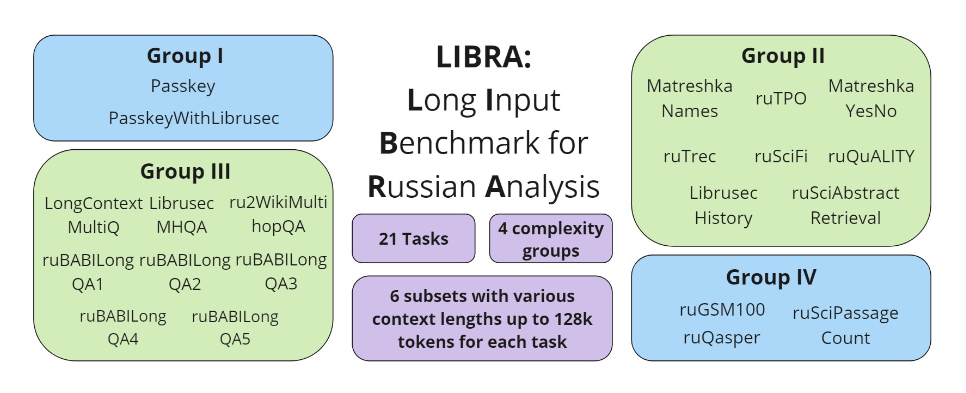

# LIBRA: Long Input Benchmark for Russian Analysis
<p align="center">
  <picture>
    
  </picture>
</p>
 
## Introduction

Welcome to the official GitHub repository for **LIBRA (Long Input Benchmark for Russian Analysis)**. This repository contains the codebase and documentation for evaluating the capabilities of large language models (LLMs) in understanding and processing long texts in Russian.

## Usage

### Adding Your Own Dataset

In order to add your own dataset, follow these steps:

  1. Add your dataset to the configs/datasets_config.json file.
  2. Create a config file using configs/template.ini for it (e.g., longchat32k.ini) and specify the necessary parameters in it.

### Generating Answers

To run the script to generate answers to the tasks, use the following command:

```bash
python main.py -c path_to_config
```

The predictions will be saved in "predictions/" or wherever you chose in your config.
### Metric Evaluation

For metric evaluation, use the following command:

```bash
python eval.py -p path_to_predictions
```
The results will be saved in "results/".
## Datasets

LIBRA includes 21 datasets adapted for different tasks and complexities. The datasets are divided into four complexity groups and allow evaluation across various context lengths ranging from 4,000 to 128,000 tokens.

<p align="center">
  <picture>
    
  </picture>
</p>

### Tasks and Complexity Groups

#### Group I: Simple Information Retrieval
- **Passkey**: Extract a relevant piece of code number from a long text fragment.
- **PasskeyWithLibrusec**: Similar to Passkey but with added noise from Librusec texts.

#### Group II: Question Answering and Multiple Choice
- **MatreshkaNames**: Identify the person in dialogues based on the discussed topic.
- **MatreshkaYesNo**: Indicate whether a specific topic was mentioned in the dialog.
- **LibrusecHistory**: Answer questions based on historical texts.
- **ruTREC**: Few-shot in-context learning for topic classification. Created by translating the TREC dataset from LongBench.
- **ruSciFi**: Answer true/false based on context and general world knowledge. Translation of SciFi dataset from L-Eval.
- **ruSciAbstractRetrieval**: Retrieve relevant paragraphs from scientific abstracts.
- **ruTPO**: Multiple-choice questions similar to TOEFL exams. Translation of the TPO dataset from L-Eval.
- **ruQuALITY**: Multiple-choice QA tasks based on detailed texts. Created by translating the QuALITY dataset from L-Eval.

#### Group III: Multi-hop Question Answering
- **ruBABILongQA**: 5 long-context reasoning tasks for QA using facts hidden among irrelevant information.
- **LongContextMultiQ**: Multi-hop QA based on Wikidata and Wikipedia.
- **LibrusecMHQA**: Multi-hop QA requiring information distributed across several text parts.
- **ru2WikiMultihopQA**: Translation of the 2WikiMultihopQA dataset from LongBench.

#### Group IV: Complex Reasoning and Mathematical Problems
- **ruSciPassageCount**: Count unique paragraphs in a long text.
- **ruQasper**: Question Answering over academic research papers. Created by translating the Qasper dataset from LongBench.
- **ruGSM100**: Solve math problems using Chain-of-Thought reasoning.

## License

This project is licensed under the MIT License.
